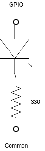

# attiny -- ATTiny84/ATTiny85 Examples using the Raspberry Pi #

## Overview ##

Most of the ATTiny examples seem to be based on the Arduino.  As I
wanted a simple example using the Raspberry Pi (the reason for all of
this is controlling telescopes using lin_guider etc.), I decided to
write this all down so I could remember it later!

## Basic Functionality ##

At the top, is a template that works on either the ATTiny84 or
ATTiny85.  It includes a way to use i2c, and a system tick, but not
much else.  For inputs, outputs, interrupts, etc. see the examples.

For the test setup, a Raspberry Pi is used to program the ATTinys and
read/write "registers.  Since the test board will have two parts (one
ATTiny84 and one ATTiny85), separate SPI and I2C interfaces are used
for each.  The EEPROM I2C interface (pins 0 and 1) and SPI0 (pins 9,
10, and 11) are used for the ATTiny84.  For the ATTiny85, I2C (pins 3
and 3) and SPI1 (pins 19, 20, and 21) are used.  Note that the EEPROM
clock and data pins do not include a pull up resitor!  A 1K resitor is
include from each to +3.3V.

BCM 22 is used as a reset, connected to both ATTinys.

In some cases, multiple pins from the Raspberry Pi connect to a single
pin on the ATTiny.  All pins related to the function not being used
(I2C or SPI) should be tristated.  In this document, the BCM numers
will be used and the 'gpio' command will be used with the '-g' option.
Details are available in makefile.attiny84 and makefile.attiny85.
Both of those makefiles include macros to switch the Raspberry
Pi/ATTiny connection to SPI mode or to I2C mode.

In addition to the obvious connections -- 3.3 V and Common -- connect
as follows.


## I2C ##

## Tick ##

Using the "blink" example (see below), the tick can be measured -- just set the rate of the LED to 16 ms.  Measuring the part I used to test attiny resulted in a bit more, 17.8 ms.


## Examples ##

In the following examples, the I2C address is 7 for no particular
reason.  The only other consistent difference is the macro for the
"Timer Interrupt Mask Register".  The ATTiny84 has TIMSK0 and the
ATTiny85 has TIMSK.

### ATTiny Simple ###

No external connections, just I2C.  Three "registers" are created, 1, 2, and 4 bytes.  All registers can be read or written using 'access'.  To run, do the following.

1. 'cd example84/simple' OR 'cd example85/simple'.
2. 'make flash'.
3. 'make access'.

After the above, access should display the values of the registers, and allow them to be changed.

```text
[ pi@raspberrypi ] ./access
Project: 0x0002 Version: 0x0001
dummys are 0x11 0x2222 0x44444444
[ pi@raspberrypi ] ./access -1 0x12 -2 0x3456 -4 0x789abcde
Project: 0x0002 Version: 0x0001
dummys are 0x12 0x3456 0x789abcde
[ pi@raspberrypi ] ./access
Project: 0x0002 Version: 0x0001
dummys are 0x12 0x3456 0x789abcde
[ pi@raspberrypi ] ./access -v
--> Starting pigpio with (localhost, 8888)
--> Opening pigpio I2C with (, 2, 3, 20000)
zip: 04 07 02 07 01 00 03 02 06 02 03 00 
buf: cd ba 
zip: 04 07 02 07 01 01 03 02 06 02 03 00 
buf: 02 00 
zip: 04 07 02 07 01 02 03 02 06 02 03 00 
buf: 01 00 
Project: 0x0002 Version: 0x0001
zip: 04 07 02 07 01 03 03 02 06 01 03 00 
buf: 12 
zip: 04 07 02 07 01 04 03 02 06 02 03 00 
buf: 56 34 
zip: 04 07 02 07 01 05 03 02 06 04 03 00 
buf: de bc 9a 78 
dummys are 0x12 0x3456 0x789abcde
```

### ATTiny Blink ###

Blink a few LEDs using the "tick" (based on the watchdog timer, see
tick.h/tick.c).  On the ATTiny 84, the outputs are PB0, PB1, and PB2;
on the ATTiny84, the outputs are PB1, PB3, and PB4.

'access' provides a way to change the blink rate of each LED.  Since
this example uses a tick based on the watchdog timer, the rate must be
a multiple of 16 ms.

Connect the output pins to the following circuit.



### ATTiny Square ###

Square wave output on PB1.  OCR1A is the "percentage on" (0...255);
the initial value is 127.  Use a low pass filter to smooth the output.
Resistor and capacitor values will depend on the load etc.


And the result is...


### ATTiny Wave (Not Implemented on ATTiny84) ###

This example uses timer/counter 1 for PWM output on PB4 and
timer/counter 0 as a trigger to change the sample.  The samples are
stored in eeprom.  An example of generating sample sets is provited by
wavegen.c (after compiling, see ./wavegen -h for a description).
Writing the sample to eeprom is handled by the 'eeprom' target in
makefile.attiny.  First a binary is created by wavegen, then the make
target converts the binary to Intel hex and writes it to the eeprom
using avrdude.

As the interrupts from timer/counter 0 are fairly fast, I2C is not
supported.

Use a low pass filter on the output as follows.


### ATTiny ADC (Not Implemented on ATTiny84) ###

### ATTiny Activity (Not Implemented on ATTiny84) ###
